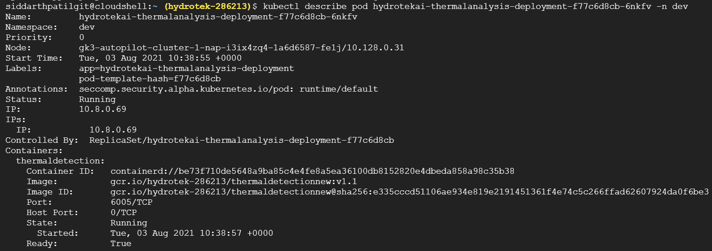

# Initial Setup  
Install Docket Desktop from [here](https://www.docker.com/products/docker-desktop)  

# Clone repository  
`git clone https://gitlab.com/iot15/apiserver-app`  
  
# Running docker container:  
`docker build -t hydroappserver:v1.0 .`  
`docker run -dt hydroappserver:v1.0 .`  
`docker ps -a`  
Next, copy container id  
`docker exec -it [container id] sh`  
`npm run serverstart`  
`CTRL-C`  
`exit`  
  
`docker build -t hydroappserver:v1.1 .`  
`docker ps -a`  
Copy new container id  
`docker stop [container id]`  
`docker run -it --expose 3000 -p 3000:3000 hydroappserver:v1.1`  
  
Open a new terminal   
`curl http://localhost:3000/fertigation-system-settings/find`  

To test broker: http://www.hivemq.com/demos/websocket-client/
  
# Push to GCP  
`gcloud auth print-access-token |docker login -u oauth2accesstoken --password-stdin https://gcr.io`  
(Replace with correct version numbers)  
`docker build -t gcr.io/hydrotek-286213/hydroapiserver:v1.0 .`   
`docker push gcr.io/hydrotek-286213/hydroapiserver:v1.0`

# Kubernetes
```
kubectl create deployment hydrotek-apiserver --image=gcr.io/hydrotek-286213/hydroappserver:v1.0 -n dev
kubectl get deployment -n dev
kubectl get pods -w -n dev
kubectl expose deployment hydrotek-apiserver --type=LoadBalancer --port 3000 -n dev
kubectl get service -n dev
```

# Updating the Kubernetes app
The basic idea is to provide a rollout update of the Kubernetes app with a new version of code that has bugs fixed or has additional functionalities. The detailed steps to be followed are:

1. Using a new tag create a docker image -> 
`docker build -t thermaldetection:v1.1 .`
2. Run and test the image in local using the `docker run` command as shown above.
3. If everything looks good then push it to Google Cloud Container Registry (GCR) ->
`gcloud auth print-access-token |docker login -u oauth2accesstoken --password-stdin https://gcr.io`
`docker build -t gcr.io/hydrotek-286213/thermaldetectionnew:v1.1 .`
`docker push gcr.io/hydrotek-286213/thermaldetectionnew:v1.1`
4. Login to the GCP's Kubernetes engine and connect to Cloud shell Editor ->
`gcloud container clusters get-credentials autopilot-cluster-1 --region us-central1 --project hydrotek-286213`
5. Get the available deployments in Kubernetes ->
`kubectl get deployments -n dev`
6. To list the running Pods ->
`kubectl get pods -n dev`
7. To view the current image version of the app, run the describe pods command and look for the Image field ->
`kubectl describe pod hydrotekai-thermalanalysis-deployment-f77c6d8cb-6nkfv -n dev`
or
`kubectl describe pod [pod-name] -n dev`

**Example Output:**

**Note:** Look for App name under **Labels** and the container name under **Containers**

8. To update the image of the application to the new version, use the set image command, followed by the deployment name and the new image version ->
`kubectl set image deployments/hydrotekai-thermalanalysis-deployment thermaldetection=gcr.io/hydrotek-286213/thermaldetectionnew:v1.1 -n dev`
or
`kubectl set image deployment/[app-name] [container-name]=[docker-image-path]` 