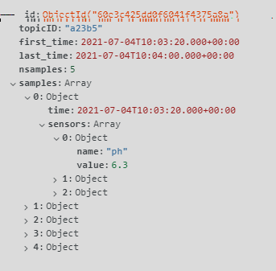
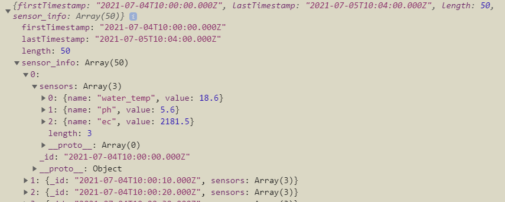

Could not finish reworking this issue before leaving. This is a memo for future devs working on this issue.

This is related to the analytics / historical data feature of the app/server. Each time the app updates or fetches relevant sensor data, it calls the `get_sensor_data` endpoint with the start/end dates and the topicID, and receives the data from apiserver which contains all data points within that timeframe and for that device.

### Debugging endpoints cheatsheet

`/get_sensor_data/:topicID/:start_date/:end_date`

`	//Getting sensor data`

`	//topicID: 5-digit topic ID for Device`

`	//start_date/end_date: in ISO format, UTC time (?). In format like (2020-07-07T10:00:00.000Z)`

`/insert_fertigation_data/:topicID/:start_date/:interval/:duration`

`/insert_climate_controller_data/:topicID/:start_date/:interval/:duration`

`	//generates big amounts of data based on parameters:`

`	//topicID: 5-digit topic ID`

`	//start_date: Starting date in UTC, ISO format: like (2020-07-07T10:00:00.000Z)`

`	//interval: Time between each data point (in seconds)`

`//duration: Total time of sensor data to generate (in seconds) - if interval = 10s and duration = 30s, there would be 3 groups of data`

`/remove_all_sensor_data/:topicID`

`//Removes all sensor data in the database matching topicID. Note: Deleting a lot of entries seems to take a few seconds or more, refresh the DB collections page to see when it's done doing that.`

### MongoDB data structure

This is an example of the data structure inside the DB. Each object has 5 samples spaced equally by (at the time of writing) 10 seconds. Each of those contains measurements for each sensor at the designated `time`.

The sensor names are (at the time of writing) `ph, ec, water_temp, air_temp, humidity, co2`

### App (desired result) data structure

The resulting data structure (that is returned from the apiserver to the variable management service inside the app) instead has a `sensor_info `array of all the sensor data in sorted time order, like below. Since the query contained 50 elements, the length of it is 50. Every object in `sensor_info `has the `sensors `array again, but the `time `attribute is called` _id`.

### Performance issue

Upon doing a full test, two issues were found. 1) the aggregation step for the get_sensor_data endpoint took a overwhelming period of time to finish, taking up to 4 seconds for a query of size 5000. 2) When fetching data points for a time period of 1 month (size of 86400 \* 31 / 10 = 267840 points), the local server hosted via npm crashed due to the heap running out of memory.

The aggregation step was programmed by a previous intern.
