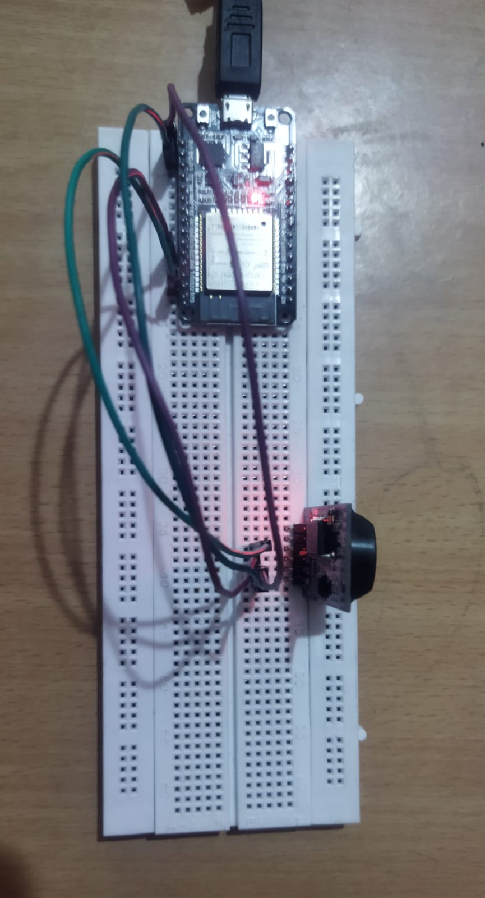
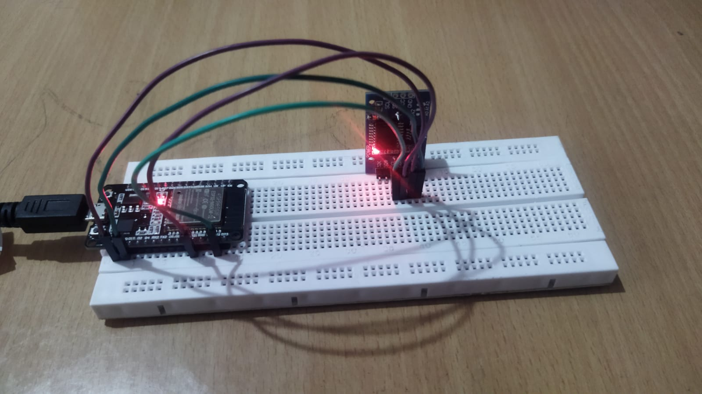
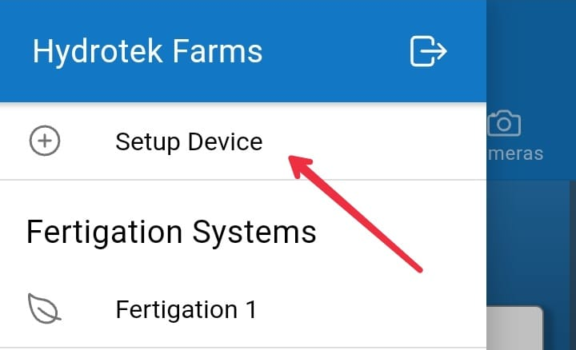
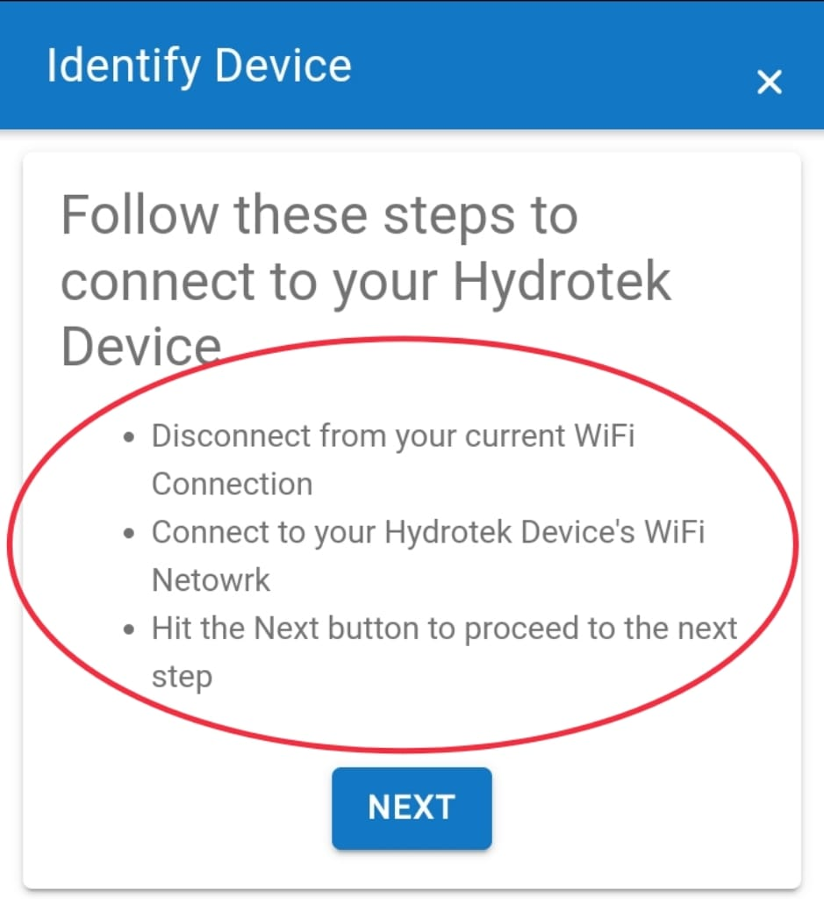

## 

- git clone the repos
```
git clone git@gitlab.com:iot15/esp32_automation.git
```

## How to setup esp-idf:
```
mkdir %userprofile%\esp
cd %userprofile%\esp
git clone --recursive https://github.com/espressif/esp-idf.git
```
-install python 3.9 and make sure to check box on the bottom so it is in PATH

- To install the esp-idf tools
```
cd %userprofile%\esp\esp-idf
install.bat esp32
```

## How to change esp-idf version: (use gitbash window)
- As we use v4.0,change the esp-idf version to 4.0
```
cd $IDF_PATH
git fetch
git checkout release/v4.0
git submodule update --init --recursive
```

## Starting a project (use command prompt)
```
cd %userprofile%\esp\esp-idf
export.bat
```

## Connect the device
- Connect your ESP32 board to the computer and check under what serial port the board is visible.
- If you are not sure how to check the serial port name, please refer to https://docs.espressif.com/projects/esp-idf/en/latest/esp32/get-started/establish-serial-connection.html for full details


## Components Required
- ESP32-WROOM-32(ESP32 Doit)
- RTC DS3231SN
- Connectors
- Data Connector
- Breadboard

## ESP32 Pinout Diagram


## Connections
- Connect ESP32-WROOM-32 to RTC via GPIO pins
- To know the GPIO pins visit the code esp32_automation->components->ports.h
- Connect SDA,SCL,VCC,GND of RTC to GPIO_21,GPIO_22,3V3,GND of ESP32 respectively.




- Before building the repository, please comment out the below code in boot.c file
```
init_reset_semaphore();
	init_hard_reset_button();
	xTaskCreatePinnedToCore(hard_reset, "hard_reset_task", 2500, NULL, HARD_RESET_TASK_PRIORITY, &hard_reset_task_handle, 0);

```
## Build the project
```
idf.py build
```

## Flash the device
```
idf.py -p PORT flash
```
- Replace the PORT with your esp32 board's serial port name


## Monitor the device
```
idf.py monitor
```


## References
- ESP-IDF Documentation: https://docs.espressif.com/projects/esp-idf/en/latest/esp32/get-started/
- Introduction to ESP32: https://learnesp32.com/videos
- ESP-WROOM-32 Datasheet: https://www.espressif.com/sites/default/files/documentation/esp32-wroom-32_datasheet_en.pdf
## Install the app
- Install the Hydrotek app: https://play.google.com/store/apps/details?id=com.hydrotekfarm&hl=en

## Login 
- Login into the device with the below credentials:
- Username: `admin@hydrotek.us`
- Password: `Hydrotek@123`
- Follow the below steps to setup your Hydrotek app:
#### --> Click on 'Setup Device' on side Menubar.


#### --> Follow the given steps and then hit next.


#### --> Enter your Wifi credentials and click next.
#### --> Name the system.
#### --> Now enable all the "Monitoring only" checkboxes of PH, EC, Water Temperature.
#### --> Give some random values for PH, EC, Water Temperature, Irrigation, Reservoir, Grow Lights....now click next.
#### --> Now your app has been setup:)