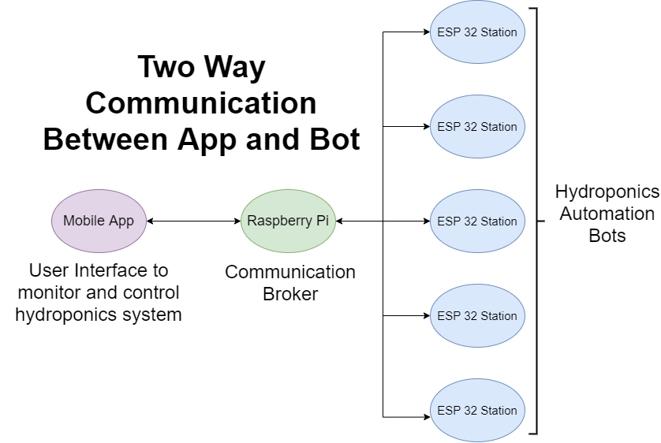
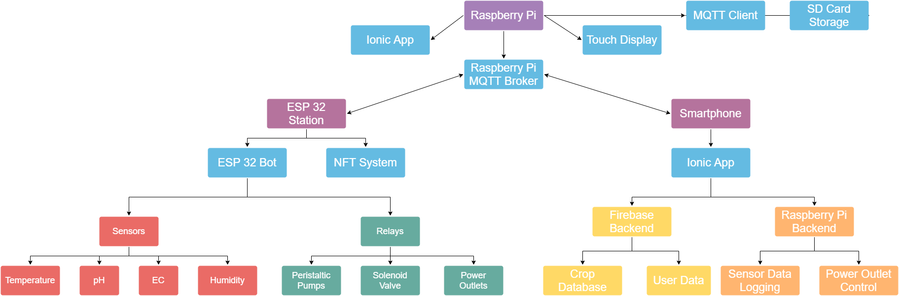
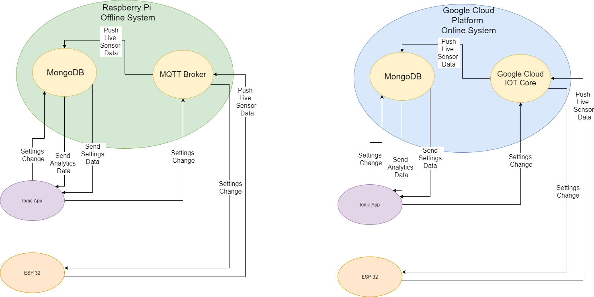

# Introduction 

From high yield and short growing times to year-round growth, Hydroponics has numerous advantages over conventional soil-based farming. However, its requirement of in-depth knowledge of hydroponic growing and constant monitoring of environmental variables such as EC/pH make it a time-intensive task for existing hydroponic farmers and a challenging learning process for newcomers. Our Hydroponics Automation Bot aims to solve these problems. It takes the complexity away from hydroponic farming by reducing the workload of the farmer. The bot will perform the otherwise time-intensive task of constantly monitoring and adjusting the pH and EC of the hydroponic nutrient solution. To keep the farmer updated with the state of the hydroponics system, it will send timely notifications to the farmer on a mobile application. Although the bot actively monitors and adjusts the hydroponics system, the farmer will have complete control of the system through the app. The bot will revolutionize the hydroponic farming process, as farmers would move away from the traditional time-intensive role of actively monitoring, maintaining, and growing hydroponic plants. Farmers would instead focus on managing their bots and scaling their farms with more automation.

# Requirements

*  Log pH, EC, Temperature, and Humidity to app
*  Maintain pH and EC of the hydroponics solution
*  Surveillance System to monitor the growth of plants 
*  Control pumps and other accessories (camera, power outlets, etc) through the app 
*  Store environmental variable data from the last 7 days into SD Card 
*  Display graphs of environmental variables from the last 7 days

# High-Level Architecture

# Relationship Chart

# Backend Structure

