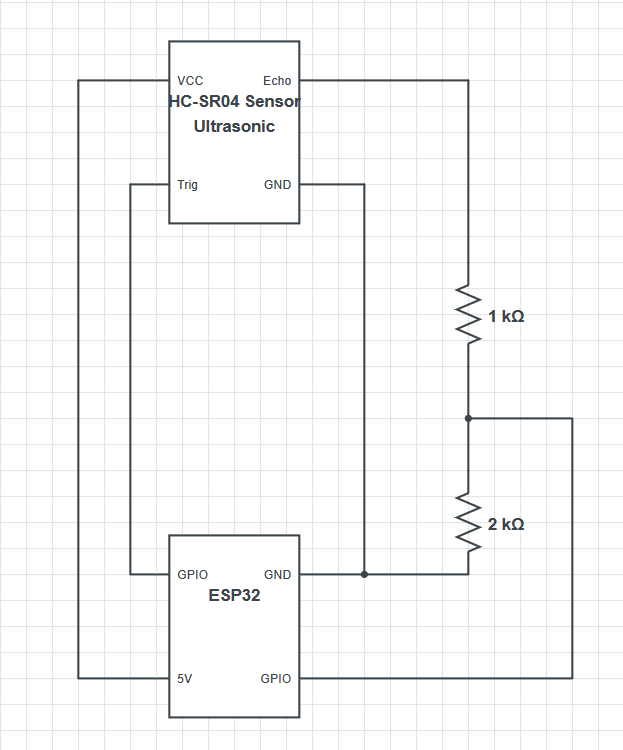

# HC-SR04 Ultrasonic Sensor

## Wiring Diagram

The HC-SR04 ultrasonic sensor is a fairly accurate distance sensor at close ranges. However, at larger distances such as 60cm and greater, accuracy reduces to be significantly off (6-7cm or greater margin of error). 

The programming libraries used are [here](https://github.com/UncleRus/esp-idf-lib/tree/master/components/ultrasonic). Using the library, a struct of type `ultrasonic.md_sensor_t` creates the sensor by assigning trigger and echo ports. `ultrasonic.md_init(&sensor);` initializes the sensor and `ultrasonic.md_measure_cm(const ultrasonic.md_sensor_t *dev, uint32_t max_distance, float *distance)` polls the values.
